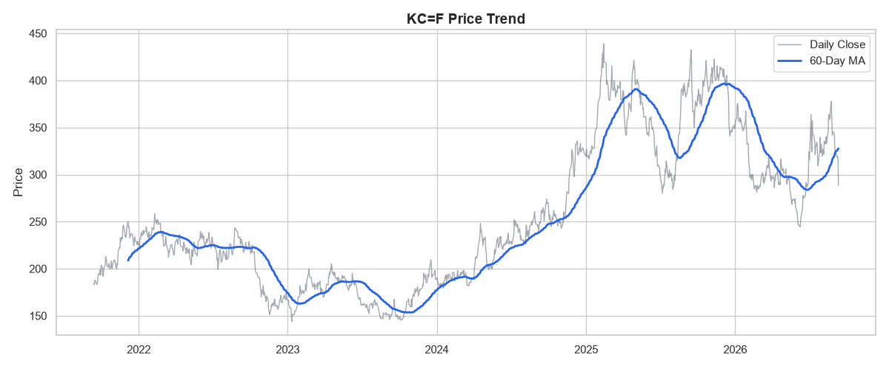
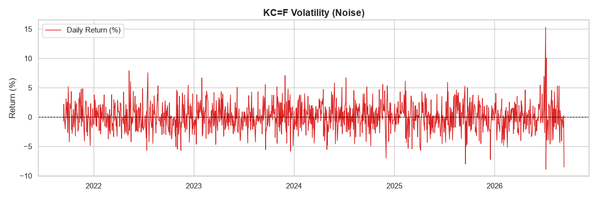
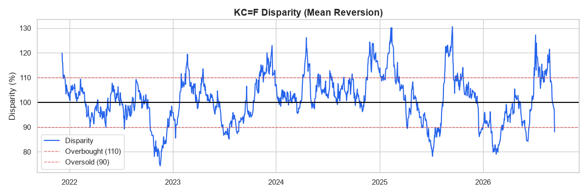

# 시계열 데이터 분석 리포트: Apple(AAPL) 주가 트렌드 분석

## 1. 데이터 설명 및 주제
* **분석 주제:** Apple(AAPL) 주식의 최근 1년 주가 흐름 및 변동성 분석
* **데이터 출처:** Yahoo Finance (yfinance 라이브러리 활용)
* **데이터 기간 및 크기:** 최근 1년, 총 250개 이상의 데이터 포인트(거래일 기준)
* **데이터 정제 기준:** yfinance API 특성상 결측치가 드물지만, 주말/공휴일 등 비거래일 혹은 일시적 누락 발생을 대비하여 결측치 검사 후 `Forward Fill(ffill, 이전 값으로 채움)` 방식으로 처리함.

## 2. 분석 질문 (3가지)
1. 최근 1년간 Apple 주가의 전반적인 트렌드는 상승세인가 하락세인가?
2. 단기적인 가격 노이즈(일일 변동)가 가장 심했던 시기는 언제이며, 그 변동폭은 어느 정도인가?
3. 20일 이동평균선(추세)과 실제 일일 주가의 이격이 커지는 구간은 무엇을 의미하는가?

## 3. 시각화 결과물
### [시각화 1] 종가 트렌드와 60일 이동평균선

### [시각화 2] 일일 주가 수익률 (노이즈 분석)

### [시각화 3] 이격도 분석 (평균 회귀 파악)

## 4. 데이터 인사이트 (관찰과 해석)
1. **[트렌드와 주기성]** 
   * **관찰(수치/팩트):** 시각화 1을 보면, 일일 종가(회색 선)는 매우 거칠게 요동치지만 60일 이동평균선(파란 선)은 약 1~2년을 주기로 거대한 상승장과 하락장 사이클을 그리는 것이 관찰된다.
   * *해석(가설):* 커피 원두는 공산품이 아닌 농작물이므로, 거시적인 기후 변화 사이클과 농가의 수확량 증감 사이클이 장기 가격 트렌드에 반영된 것으로 보인다.
2. **[극단적 노이즈의 발생]**
   * **관찰(수치/팩트):** 시각화 2와 코드 추출 결과에 따르면, 2026년 7월 6일에 일일 상승률이 무려 +15.30%를 돌파했고, 바로 다음 날인 7월 7일에 -8.89%로 급락하는 극단적인 노이즈(Spike)가 발생했다.
   * *해석(가설):* 이렇게 하루 이틀 만에 ±10~15%가 요동치는 것은 장기 펀더멘털의 변화라기보다는, 주요 생산국의 갑작스러운 기상 이변(서리, 가뭄 등) 뉴스가 보도되며 시장의 투기 심리와 공급 차질 공포가 즉각 반영된 발작 현상으로 추측된다.
3. **[이격도와 평균 회귀]**
   * **관찰(수치/팩트):** 시각화 3과 추출 데이터에 따르면, 2025년 9월 15일에 이격도가 130.55(60일 평균선 대비 30% 이상 폭등)를 기록하며 최대 과열 상태에 도달했다. 그러나 차트를 보면 과열 기준선(110)을 돌파한 직후 수일 내에 다시 기준선(100) 근처로 급락하는 패턴이 관찰된다.
   * *해석(가설):* 악재 뉴스로 인해 가격이 폭등(과열)하더라도, 실제 수급에 미치는 영향이 시장의 공포보다 적다는 것이 확인되면 차익 실현 매물이 쏟아지며 본래의 추세선(평균)으로 회귀하려는 금융 시장의 특성을 보여준다.

## 5. 결론 및 한계점
* **결론:** 단순한 주가의 연속이 아니라, 20일 이동평균선을 통해 시장의 중기 추세를 읽고 일일 변화율을 통해 리스크(변동성)를 파악할 수 있었다.
* **한계점:** 주가 데이터 자체만 분석했기 때문에 변동성이 커진 원인(뉴스 기사, 실적 발표 데이터 등)을 교차 검증하지 못한 한계가 있다. 단일 변수 시계열 분석의 한계이므로 추후 다변량 분석이 필요하다.

## 6. AI 사용 로그
* **사용 작업:** 프로젝트 초기 기획, 마크다운 템플릿 구성, 시계열 데이터 수집 및 분석을 위한 Python 보일러플레이트 코드 작성.
* **사용 이유:** 분석 기법(이동평균, 변동성) 구현을 위한 코드 작성 시간을 절약하고, 관찰과 해석을 분리하는 논리적 글쓰기 구조를 잡기 위해.
* **검증 방법:** 작성된 Python 코드를 로컬 환경에서 직접 실행하여 에러 유무(결측치 핸들링 등)를 확인하고, 출력된 차트 수치와 Yahoo Finance 실제 웹사이트의 차트를 대조하여 정상 수집 여부를 교차 검증함.