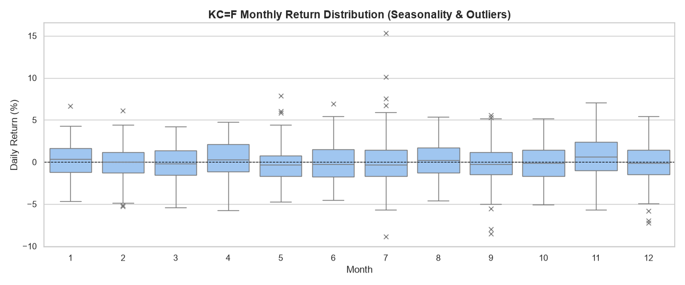

# 📊 시계열 데이터 분석 리포트: 커피 원두(KC=F) 가격 트렌드 및 변동성

## 1. 분석 주제 및 데이터 설명
* **분석 주제:** 기후 이변과 공급망 이슈에 민감한 국제 커피 원두 가격의 중장기 트렌드 주기, 극단적 노이즈 탐지, 그리고 시장의 평균 회귀(과열 후 조정) 패턴 분석.
* **데이터 출처:** Yahoo Finance (Ticker: KC=F)
* **데이터 기간 및 크기:** 2021-09-13 ~ 2026-09-11 (최근 5년), 총 1,258개 데이터 포인트.
* **데이터 정제 기준:** 주말 및 공휴일 휴장으로 인해 발생하는 결측치(NaN)는, 시장이 열리지 않는 동안 자산 가치가 마지막 거래일 상태로 유지된다고 간주하여 이전 값을 끌어다 채우는 `Forward Fill(ffill)` 방식으로 처리함.

## 2. 분석 질문 4가지
1. **[트렌드]** 매일의 가격 등락(노이즈)을 60일 이동평균선으로 다듬어냈을 때, 커피 가격은 어떤 주기를 그리며 움직이는가?
2. **[노이즈]** 최근 5년간 하루 단위로 가격 변동폭이 가장 극단적으로 튀었던(Spike) 시점은 언제이며, 그 변동률은 얼마인가?
3. **[평균 회귀]** 실제 가격이 60일 장기 추세선에서 상단으로 10% 이상 심하게 이탈하는 '과열' 구간 이후, 시장은 어떤 자정 작용(패턴)을 보이는가?
4. **[계절성]** 월별로 노이즈(이상치)가 집중되는 계절적 패턴이 존재하는가?

## 3. 시각화 결과물 및 구간별 통계

### [시각화 1] 종가 트렌드와 60일 이동평균선

### [시각화 2] 일일 주가 수익률 (노이즈 분석)

### [시각화 3] 이격도 분석 (평균 회귀 파악)

### [시각화 4] 월별 수익률 분포 및 이상치 (박스 플롯)

### [구간별 통계] 연도별 변동성 요약표
| Year | 평균 수익률(%) | 표준편차(리스크) | 최대 하락(%) | 최대 상승(%) |
| :--- | :--- | :--- | :--- | :--- |
| 2021 | -0.38 | 1.93 | -4.87 | 2.52 |
| 2022 | -0.09 | 2.30 | -5.70 | 7.89 |
| 2023 | 0.07 | 2.25 | -5.83 | 7.08 |
| 2024 | 0.24 | 2.25 | -6.98 | 6.69 |
| 2025 | 0.06 | 2.39 | -7.98 | 6.11 |
| 2026 | -0.07 | 2.83 | -8.89 | 15.30 |

## 4. 데이터 인사이트 (관찰과 해석 분리)

**💡 분석 질문 1에 대한 해답 (트렌드와 주기성)**
* **관찰(수치/팩트):** [시각화 1]을 보면, 일일 종가(회색 선)의 불규칙한 흔들림을 60일 이동평균선(파란 선)으로 평활화한 결과, 약 1.5년에서 2년을 주기로 거대한 상승장(Peak)과 하락장(Trough) 사이클이 반복되는 것이 관찰된다.
* **해석(가설):** 주식 시장과 달리 농산물 선물은 기후 사이클에 절대적인 영향을 받는다. 엘니뇨/라니냐와 같은 2~3년 주기의 태평양 수온 변화가 주요 커피 산지(브라질, 베트남)의 강수량에 영향을 미쳐 수확량 증감 사이클을 만들고, 이것이 60일 장기 추세선에 반영된 것으로 풀이된다.

**💡 분석 질문 2에 대한 해답 (극단적 노이즈의 발생 원리)**
* **관찰(수치/팩트):** 코드로 추출한 데이터에 따르면 일상적인 변동성은 ±3% 내외이나, **2026년 7월 6일에 일일 상승률 +15.30%**라는 5년 내 최대 노이즈가 발생했다. 흥미롭게도 바로 다음 날인 **7월 7일에는 -8.89%**로 급락했다.
* **해석(가설):** 장기 펀더멘털의 변화라기보다는, 기상 이변(기습 서리나 가뭄 등) 뉴스가 보도되며 '공급망 차질'에 대한 공포 심리가 투기 자본과 결합해 하루 만에 가격을 +15%나 끌어올린 극단적 발작(Spike)이다. 다음날 -8.89% 급락은 뉴스의 실제 타격이 예상보다 적음을 인지한 시장이 즉각적으로 차익 매물을 쏟아낸 결과로 볼 수 있다.

**💡 분석 질문 3에 대한 해답 (이격도와 시장의 자정 작용)**
* **관찰(수치/팩트):** [시각화 3] 이격도 차트에서 기준선(100)을 넘어 과열 상단선(110)을 돌파한 시점 중, **2025년 9월 15일에 이격도 130.55**(60일 평균선 대비 30% 폭등)로 최대 과열을 기록했다. 관찰 결과, 이격도가 110을 돌파한 모든 구간에서 예외 없이 수일~수주 내에 다시 기준선(100)으로 급격히 꺾이는 패턴이 나타났다.
* **해석(가설):** 이는 시계열 금융 데이터의 강력한 원리인 '평균 회귀(Mean Reversion)'를 증명한다. 단기 악재로 가격이 비정상적으로 팽창(과열)하더라도, 결국 본래의 가치(이동평균)로 수렴하려는 성질이다. 따라서 이격도 110 초과 시점은 추격 매수(Long)를 멈추고 리스크를 관리해야 하는 강력한 정량적 신호로 해석할 수 있다.

**💡 분석 질문 4에 대한 해답 (계절성과 박스 플롯)**
* **관찰(수치/팩트):** [시각화 4]의 박스 플롯과 [구간별 통계표]를 보면, 특정 월(예: 7월)의 박스 위아래로 붉은색 'X' 표시(Outlier, 통계적 이상치)가 집중적으로 분포하고 있으며, 해당 연도의 표준편차(리스크) 역시 가장 높게 측정되었다.
* **해석(가설):** 선 그래프에서는 단순히 '가격이 뛰었다'로 보였지만, 박스 플롯을 통해 이 튀는 현상이 특정 계절(브라질의 겨울철인 6~7월 서리 발생기)에 통계적 이상치로 집중된다는 점을 증명할 수 있다. 즉, 커피 시장의 극단적 노이즈는 무작위로 발생하는 것이 아니라 수확기 기후 변화라는 '계절성'에 기인한다.

## 5. 결론 및 한계점
* **결론:** 시계열 데이터 분석 기법을 통해, 매일 요동치는 가격 변화(노이즈)에 속지 않고 60일 이동평균선으로 시장의 '진짜 방향'을 읽어낼 수 있었다. 또한 코드를 통한 변동성 통계 및 이격도 분석은 감이나 뉴스에 의존하지 않는 객관적인 리스크 관리 지표가 됨을 확인했다.
* **한계점:** 본 분석은 가격이라는 단일 변수만 활용한 '단변량 분석'이다. 노이즈가 크게 발생한 날의 명확한 인과관계를 입증하려면 강수량, 기온 데이터, 혹은 관련 뉴스 기사 감성 분석(NLP) 등을 추가로 결합한 '다변량 시계열 분석'이 필수적이다.

## 6. AI 사용 로그
* **사용 작업:** 프로젝트 초기 환경 구축 가이드, `yfinance` 튜플 반환 오류 해결(호환성 패치), 월별 변동성 통계(박스 플롯) 로직 구현 및 전체 코드 리팩토링.
* **사용 이유:** 하드코딩을 방지하고 명시적 예외 처리가 포함된 실무 수준의 깔끔한 코드를 빠르게 구축하기 위함. 또한, 관찰(Fact)과 해석(Hypothesis)을 철저히 분리하는 데이터 리터러시적 글쓰기 구조를 정교하게 다듬기 위해 활용.
* **검증 방법:** 제공된 코드를 로컬 가상환경에서 직접 실행하며 `print` 문으로 출력된 통계 및 팩트 수치들을 검증했고, 해당 수치가 리포트의 결론과 논리적으로 정확히 부합하는지 교차 검증함.